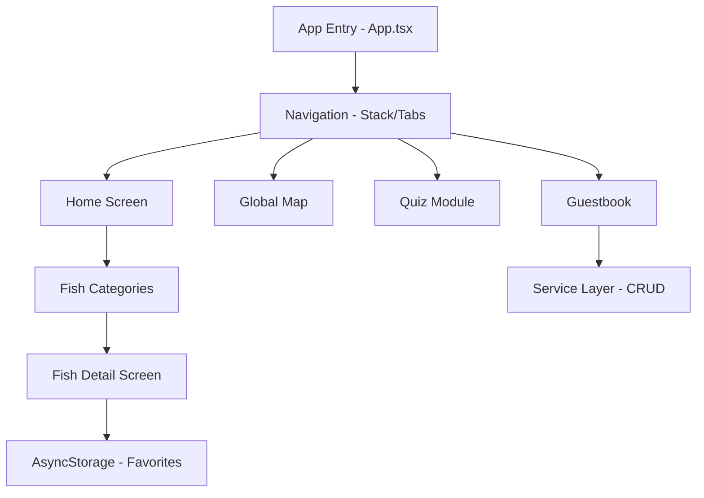

# 🐟 Elazığ Su Ürünleri Müzesi (Mobil Rehber)
[](https://expo.dev)
[](https://reactnative.dev)
[](https://www.typescriptlang.org/)
[](LICENSE)

> ### 📦 Proje Derleme & Tanıtım Bağlantıları (Google Drive)
> Uygulamanın fiziksel testleri için derlenmiş paketlere ve uygulama tanıtım videosuna aşağıdaki linklerden doğrudan ulaşabilirsiniz:
> *   🤖 **Android Kurulum Paketi (APK - Release):** https://drive.google.com/drive/folders/1szXR4_zITPMLJwn4pOo9hRobD_kT-vJZ?usp=sharing
> *   🍏 **iOS Kurulum Paketi (IPA - Release):** https://drive.google.com/drive/folders/1szXR4_zITPMLJwn4pOo9hRobD_kT-vJZ?usp=sharing
> *   🎥 **Uygulama Tanıtım / Demo Videosu:** https://drive.google.com/drive/folders/1szXR4_zITPMLJwn4pOo9hRobD_kT-vJZ?usp=sharing

---

Elazığ Su Ürünleri Araştırma Enstitüsü bünyesinde bulunan **Balık Müzesi** için tasarlanmış premium dijital rehber uygulamasıdır. Bu uygulama, Fırat Havzası ve bölgesel baraj göllerindeki biyoçeşitliliği dijital dünyaya taşıyarak ziyaretçilere interaktif bir deneyim sunar.

---

## 🚀 Proje Amacı
Bu proje, müze ziyaretçilerinin sergilenen türler hakkında derinlemesine bilgi sahibi olmasını, endemik türlerin korunması bilincinin artırılmasını ve bölgenin su ürünleri potansiyelinin modern teknolojilerle (QR, AI, İnteraktif Harita) tanıtılmasını amaçlar.

## ✨ Temel Özellikler

### 1. İnteraktif Biyoçeşitlilik Haritası
Elazığ bölgesinin su kaynaklarını (Keban, Sivrice, Ağın) kapsayan özel tasarım harita üzerinden türlerin yoğunluk alanlarını ve habitatlarını görsel olarak keşfedin.

### 2. Akıllı Tür Tanıma (QR & Scan)
Müzede yer alan her tür için özel QR kodlar üzerinden anında erişim. `AI Camera` simülasyonu ile balık türlerinin görsel üzerinden tanınması.

### 3. Kapsamlı Tür Veritabanı
*   **Fırat Havzası Türleri:** Benekli Siraz, Bıyıklı Balık, Bizir, Kefal, Kızılkanat.
*   **Baraj Gölü Türleri:** Gümüş Balığı.
*   **Yırtıcı Türler:** Dev Fırat Turnası (Caner Balığı).
*   **Endemik Türler:** Bölgeye özgü Elazığ Sirazı.

### 4. Eğitici ve Sosyal Katılım
*   **Quiz Modülü:** Ziyaretçilerin bilgilerini test edebileceği 5 soruluk dinamik sınav sistemi.
*   **Dijital Ziyaretçi Defteri:** Gerçek zamanlı yorum ve derecelendirme sistemi.
*   **İstatistik Paneli:** Müzedeki toplam tür sayısı ve ziyaretçi etkileşim verileri.

---

## 🛠 Teknik Mimari

Uygulama, yüksek performans ve akıcı animasyonlar için optimize edilmiş bir mimari üzerine inşa edilmiştir.



### Kullanılan Önemli Paketler:
*   **expo-image:** Resim yükleme hızını %300 artıran ve disk üzerinde cache yapan motor.
*   **lucide-react-native:** Modern ve minimalist ikon seti.
*   **expo-linear-gradient:** Premium cam-morphism ve degrade efektleri.
*   **i18next:** Türkçe, İngilizce ve Arapça tam dil desteği.

---

## 📦 Kurulum ve Çalıştırma

### Gereksinimler
*   Node.js (v18+)
*   npm veya yarn
*   Expo Go (Mobil cihazınızda)

### Adımlar
1.  **Projeyi indirin:**
    ```bash
    git clone https://github.com/starboyz-software/su-urunleri-balik-muzesi.git
    cd su-urunleri-balik-muzesi
    ```
2.  **Bağımlılıkları kurun:**
    ```bash
    npm install
    ```
3.  **Metro Bundler'ı başlatın:**
    ```bash
    npx expo start
    ```
4.  **Uygulamayı açın:**
    *   Android: `a` tuşuna basın veya QR kodu Expo Go ile taratın.
    *   iOS: `i` tuşuna basın veya Camera uygulaması ile taratın.

---

## 📁 Dosya Yapısı
```text
src/
├── assets/             # Görsel varlıklar (Balık resimleri, haritalar)
├── data/               # Yerel veritabanı (FishData.ts)
├── i18n/               # Dil dosyaları (Locales)
├── screens/            # Uygulama ekranları (Home, Map, Quiz vb.)
├── services/           # Veri servisleri (Guestbook, History)
└── theme/              # Renk paleti ve Tema yönetimi
```


## 👥 Proje Geliştirme Ekibi

Bu proje, aşağıdaki geliştirici ekibi/öğrenciler tarafından hazırlanmıştır:

| Adı Soyadı | Öğrenci Numarası |
| :--- | :--- |
| **Ahmet Berk Yıldız** | 225541047 |
| **Ruşen Ali Durmaz** | 225542019 |
| **Muhammed Sönmez** | 225541045 |
| **Hamit Korkmaz** | 225541042 |
| **Kenan Karabey** | 235542026 |

---

## 🤝 Katkıda Bulunma
Bu proje kapalı bir kurum projesidir. Hata raporları veya özellik önerileri için lütfen `issue` açın veya geliştirici ekiple iletişime geçin.

## ⚖️ Lisans
Bu proje **Elazığ Su Ürünleri Araştırma Enstitüsü**'nün fikri mülkiyetindedir. İzinsiz kopyalanması veya ticari amaçla kullanılması yasaktır.

---
<p align="center">
  <b>Elazığ Su Ürünleri Müzesi - Teknolojinin Doğa ile Buluştuğu Nokta</b><br/>
  <sub>Developed by Antigravity</sub>
</p>
